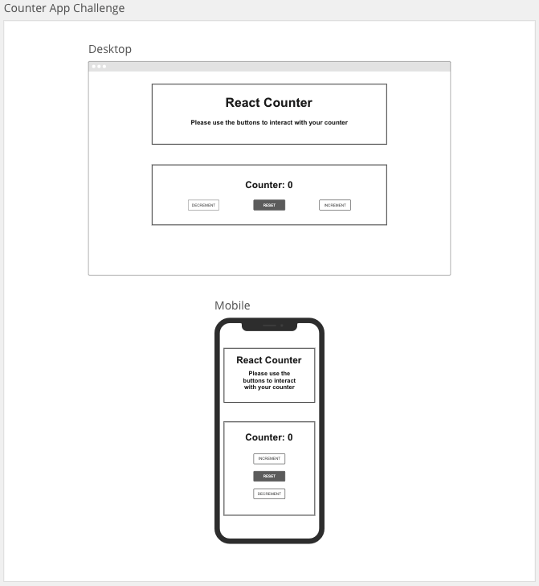

# Class-Based Counter App

## User Story

> As a user I want to be increase a counter value, decrease a counter value up to 0, and reset a counter value to 0.

## Acceptance Criteria

> Must use function-based components and hooks

> Must contain a banner on the top of the page with a title of "React Counter" and a sub-title of "Please use the buttons to interact with your counter".

> The counter value must be displayed as `Counter: 0` on initial load in the counter section.

> The counter value must increase the current count value by 1 when the user clicks on the "Increment" button.

> The counter value must decrease the current count value by 1 when the user clicks on the "Decrement" button.

> The counter value must reset the current count value to 0 when the user clicks on the "Reset" button.

> The counter value must not decrement the current value below `0` (no negative values for the counter).

## Design Guide



## Getting Started

1. > Navigate to your `coding_bootcamp` workspace:

```
cd ~/coding_bootcamp
```

2. > Create a react project using the `create-react-app` script and use your own app name:

```
npx create-react-app your-app-name
cd your-react-app
```

3. > Create a repository in [GitHub](https://github.com/new) and enter the "Repository name" as the same name as your react app.

4. > In the terminal within your react app enter the commands provided by GitHub. The first command points your local repository to the remote GitHub, the second command sets your branch as `main` and the last command pushes all your local changes to the remote repository

```
git remote add origin git@github.com:YOUR_GITHUB_USERNAME/your-app-name.git
git branch -M main
git push -u origin main
```

5. > Once you refresh your GitHub page on the web browser you will see all your local files in GitHub.

6. > You can now proceed to work locally and add commit and push code regularly during development

## Resources

- CSS framework: [Bootstrap 5](https://getbootstrap.com/docs/5.3/getting-started/introduction/)
- Colour palette: [coolors](https://coolors.co/)
- Icons: [font-awesome icons](https://fontawesome.com/icons) | [CDN](https://cdnjs.com/libraries/font-awesome)
- [React docs](https://beta.reactjs.org/)
